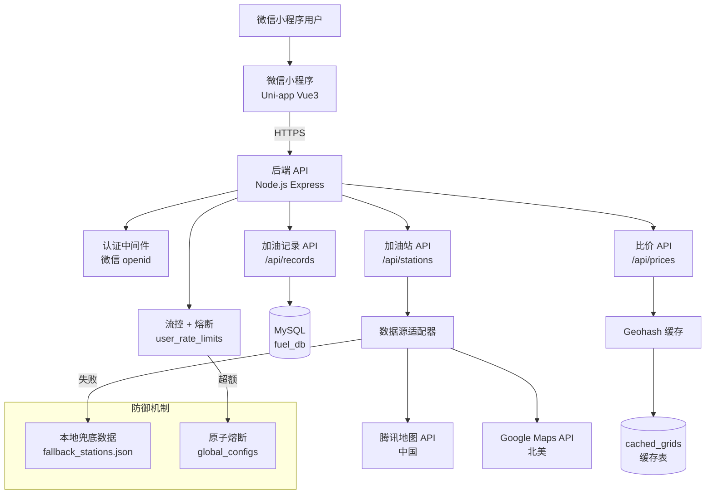
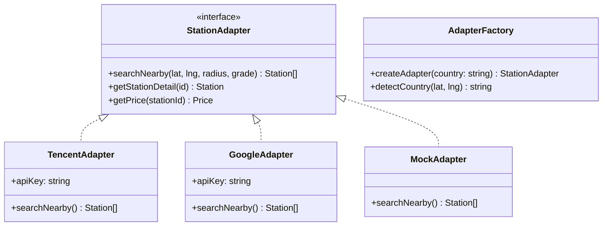

## 产品概述

一款面向全球用户的微信小程序，核心解决两大痛点：

- 北美用户：加油站油价差异大，提供半径比价功能（3/5/10/20km）
- 中国用户：油价统一，核心需求为加油记账与油耗统计

## 核心功能

- **周边加油站查询**：自动检测用户国家，路由到对应数据源（中国→腾讯地图，北美→Google Maps）
- **油价比价**：半径切换 3/5/10/20km，按最便宜/最近排序，高亮最低价
- **加油记录提交**：填写金额、油量、里程、油号，支持小票照片上传，支持「加满」标记用于油耗计算
- **油耗计算**：加满到加满法，自动切换 L/100km（公制）或 MPG（英制）
- **三国单位自动适配**：中国（中文+公制）、加拿大（英文+英制）、美国（英文+US制）
- **微信一键登录**：通过 openid 识别用户，无需密码

## 技术选型

### 前端技术栈

- **框架**：Uni-app + Vue3 + TypeScript，编译目标为微信小程序
- **UI 组件库**：tdesign-miniprogram（腾讯设计体系，与微信生态契合）
- **状态管理**：Pinia
- **微信 AppID**：wx5ebd4176b7e2eb8d

### 后端技术栈

- **运行时**：Node.js 18+，Express.js + TypeScript
- **数据库**：MySQL 8.0（host=127.0.0.1:3306, user=root, password=空, database=fuel_db）
- **外部 API**：
- 中国：腾讯地图 WebService API（地点搜索、逆地址解析）
- 北美：Google Maps Places API（Nearby Search、Place Details）
- **认证**：微信小程序登录（code2Session 换取 openid）
- **缓存**：内存缓存（Geohash grid 级别），可扩展 Redis
- **防御机制**：流控（user_rate_limits 表）+ 原子熔断（global_configs 表）+ 本地兜底数据（fallback_stations.json）

### 运行模式

- 优先实现 Mock 模式，未检测到真实数据库/API 配置时自动降级
- 无真实 API 时返回 fallback_stations.json 中的 Mock 数据

## 实现方案

### 数据源适配器设计（核心架构决策）

采用适配器模式，通过 `AdapterFactory` 根据检测到的用户国家返回对应适配器：

- `TencentAdapter`：调用腾讯地图 API，返回归一化的 Station 数据结构
- `GoogleAdapter`：调用 Google Maps API，返回归一化的 Station 数据结构
- `MockAdapter`：返回本地 JSON Mock 数据，用于开发和测试

**油号归一化方案**（解决国内外油号差异）：

```typescript
const GRADE_MAP = {
  CN: { '92#': 'regular', '95#': 'mid', '98#': 'premium', '0#柴油': 'diesel' },
  CA: { 'Regular(87)': 'regular', 'Mid(89)': 'mid', 'Premium(91)': 'premium' },
  US: { 'Regular': 'regular', 'Mid-grade': 'mid', 'Premium': 'premium' }
}
```

所有比价和计算逻辑统一使用归一化后的 `regular/mid/premium/diesel` 等级，展示时再转换为本地标签。

### 国家检测与单位自动切换

根据经纬度范围判断用户所属国家（Mock 阶段）：

- 中国境内（lat 18-54, lng 73-135）→ 中文 + 公制(L/100km) + ¥/L + km
- 加拿大（lat 43-70, lng -141~-52）→ 英文 + 英制(MPG Imperial) + C$/L + km
- 美国（lat 24-50, lng -125~-66）→ 英文 + US制(MPG US) + $/gal + miles
- 其他 → 英文 + 公制 + 本地货币

**美国油价显示策略**：主显示 $/gal，辅助显示 $/L（便于跨国比较）

### 原子流控与熔断机制

通过 SQL 事务 + `SELECT ... FOR UPDATE` 实现原子计数，避免竞态条件：

1. 每次 API 调用前开启事务，锁定用户流控记录
2. 检查当日调用次数是否超过 `global_configs` 中 `api_daily_limit`（默认 1000）
3. 未超限则原子递增计数器，提交事务，正常调用外部 API
4. 超限则回滚事务，触发熔断，返回缓存数据或兜底数据

### Geohash 缓存策略

- 使用 `ngeohash` 库计算 geohash（精度 5，约 ±2.4km）
- 缓存 key = geohash_prefix + radius + country
- 缓存存储于 `cached_grids` 表，过期时间 15 分钟
- 命中缓存直接返回，未命中才调用外部 API

### 油耗计算（加满到加满法）

```
前提：两次加油记录均为「加满」
油耗(L/100km) = (本次加油量 / (本次里程 - 上次里程)) × 100
油耗(MPG US) = (本次里程 - 上次里程) / 本次加油量 × 3.785
油耗(MPG Imperial) = (本次里程 - 上次里程) / 本次加油量 × 4.546
```

仅当两条记录都标记 `is_full_tank = true` 时才计算油耗，避免数据不准确。

### 比价功能实现（加拿大/美国核心需求）

- `GET /api/prices/compare?lat=:lat&lng=:lng&radius=:radius&sort=:sort`
- radius 参数：3, 5, 10, 20（单位 km）
- sort 参数：price（最便宜，默认）, distance（最近）
- 返回范围内所有加油站及价格，前端高亮最低价
- 中国用户也支持比价（民营站价格可能有差异）

### 防御性编程保障

- 所有外部 API 调用均有 try-catch，失败时使用本地兜底数据
- 兜底数据存于 `server/src/data/fallback_stations.json`，包含中国 + 加拿大各 20 条 Mock 数据
- 数据库连接失败时，后端返回明确错误信息，前端展示友好提示

## 架构设计

### 系统架构图



### 适配器模式类图



## 数据库设计

### schema.sql 核心表结构

```sql
CREATE DATABASE IF NOT EXISTS fuel_db DEFAULT CHARSET utf8mb4;
USE fuel_db;

-- 用户表
CREATE TABLE users (
    id INT AUTO_INCREMENT PRIMARY KEY,
    openid VARCHAR(64) UNIQUE NOT NULL,
    nickname VARCHAR(128),
    avatar_url VARCHAR(512),
    country VARCHAR(8) DEFAULT 'CN',
    unit_preference ENUM('metric','imperial') DEFAULT 'metric',
    created_at TIMESTAMP DEFAULT CURRENT_TIMESTAMP
);

-- 加油站缓存表
CREATE TABLE stations (
    id INT AUTO_INCREMENT PRIMARY KEY,
    external_id VARCHAR(128),
    source ENUM('tencent','google','mock'),
    name VARCHAR(256) NOT NULL,
    brand VARCHAR(64),
    lat DECIMAL(10,8) NOT NULL,
    lng DECIMAL(11,8) NOT NULL,
    address VARCHAR(512),
    geohash VARCHAR(12),
    price_regular DECIMAL(8,3),
    price_mid DECIMAL(8,3),
    price_premium DECIMAL(8,3),
    price_diesel DECIMAL(8,3),
    last_updated TIMESTAMP DEFAULT CURRENT_TIMESTAMP ON UPDATE CURRENT_TIMESTAMP,
    INDEX idx_geohash (geohash),
    INDEX idx_location (lat, lng)
);

-- 加油记录表
CREATE TABLE refuel_records (
    id INT AUTO_INCREMENT PRIMARY KEY,
    user_id INT NOT NULL,
    station_id INT NOT NULL,
    grade ENUM('regular','mid','premium','diesel') NOT NULL,
    amount DECIMAL(10,2) NOT NULL,
    volume DECIMAL(10,3),
    odometer DECIMAL(10,1),
    is_full_tank BOOLEAN DEFAULT FALSE,
    receipt_url VARCHAR(512),
    fuel_efficiency DECIMAL(8,2),
    efficiency_unit ENUM('L/100km','MPG') DEFAULT 'L/100km',
    created_at TIMESTAMP DEFAULT CURRENT_TIMESTAMP,
    FOREIGN KEY (user_id) REFERENCES users(id) ON DELETE CASCADE,
    FOREIGN KEY (station_id) REFERENCES stations(id) ON DELETE CASCADE,
    INDEX idx_user_time (user_id, created_at)
);

-- Geohash 缓存表
CREATE TABLE cached_grids (
    id INT AUTO_INCREMENT PRIMARY KEY,
    geohash_prefix VARCHAR(12) NOT NULL,
    radius INT NOT NULL,
    country VARCHAR(8) NOT NULL,
    data JSON NOT NULL,
    expires_at TIMESTAMP NOT NULL,
    created_at TIMESTAMP DEFAULT CURRENT_TIMESTAMP,
    UNIQUE KEY uk_grid (geohash_prefix, radius, country)
);

-- 用户流控表
CREATE TABLE user_rate_limits (
    id INT AUTO_INCREMENT PRIMARY KEY,
    user_id INT NOT NULL,
    api_calls_today INT DEFAULT 0,
    last_call_date DATE NOT NULL,
    blocked_until TIMESTAMP NULL,
    UNIQUE KEY uk_user_date (user_id, last_call_date),
    FOREIGN KEY (user_id) REFERENCES users(id) ON DELETE CASCADE
);

-- 全局配置表
CREATE TABLE global_configs (
    `key` VARCHAR(64) PRIMARY KEY,
    value TEXT NOT NULL,
    updated_at TIMESTAMP DEFAULT CURRENT_TIMESTAMP ON UPDATE CURRENT_TIMESTAMP
);

INSERT INTO global_configs (`key`, value) VALUES
('api_daily_limit', '1000'),
('circuit_breaker_open', 'false');
```

## 目录结构

### 后端目录结构（全部为 [NEW] 新建文件）

```
server/
├── src/
│   ├── app.ts                        # [NEW] Express 主入口，注册路由和中间件
│   ├── config/
│   │   └── index.ts                  # [NEW] 环境变量配置，Mock开关，API Key配置
│   ├── middleware/
│   │   ├── auth.ts                   # [NEW] 微信登录认证中间件，验证 openid
│   │   └── rateLimit.ts              # [NEW] 流控中间件，原子计数+熔断判断
│   ├── routes/
│   │   ├── auth.ts                   # [NEW] 登录路由 POST /api/auth/login
│   │   ├── stations.ts               # [NEW] 加油站查询 GET /api/stations/nearby, /:id
│   │   ├── records.ts                # [NEW] 加油记录 POST/GET /api/records, /stats
│   │   └── prices.ts                 # [NEW] 比价 API GET /api/prices/compare
│   ├── services/
│   │   ├── adapterFactory.ts         # [NEW] 适配器工厂，根据country返回对应适配器
│   │   ├── adapters/
│   │   │   ├── StationAdapter.ts     # [NEW] 适配器接口定义（TypeScript interface）
│   │   │   ├── TencentAdapter.ts     # [NEW] 腾讯地图API适配器
│   │   │   ├── GoogleAdapter.ts      # [NEW] Google Maps API适配器
│   │   │   └── MockAdapter.ts        # [NEW] Mock数据适配器（降级用）
│   │   ├── geohash.ts               # [NEW] Geohash计算工具，精度5
│   │   ├── cache.ts                 # [NEW] 缓存服务，读写cached_grids表
│   │   ├── countryDetect.ts         # [NEW] 根据经纬度检测国家CN/CA/US
│   │   ├── fuelCalc.ts              # [NEW] 油耗计算逻辑（加满到加满法）
│   │   └── unitConvert.ts           # [NEW] 单位转换（L/100km↔MPG，km↔miles）
│   ├── db/
│   │   ├── connection.ts            # [NEW] MySQL连接池配置
│   │   └── schema.sql               # [NEW] 数据库DDL，含所有表结构
│   └── data/
│       └── fallback_stations.json    # [NEW] 兜底加油站Mock数据（中加各20条）
├── package.json                      # [NEW] 后端依赖配置
└── tsconfig.json                     # [NEW] TypeScript配置
```

### 前端目录结构（全部为 [NEW] 新建文件）

```
client/
├── pages/
│   ├── index/
│   │   ├── index.vue                 # [NEW] 首页：全屏地图+底部抽屉列表
│   │   ├── index.scss                # [NEW] 首页样式（地图全屏，抽屉动画）
│   │   └── index.json                # [NEW] 页面配置（使用tdesign组件）
│   ├── station-detail/
│   │   ├── station-detail.vue        # [NEW] 加油站详情：油价卡片+导航按钮
│   │   ├── station-detail.scss       # [NEW] 详情页样式
│   │   └── station-detail.json       # [NEW] 页面配置
│   ├── refuel/
│   │   ├── refuel.vue                # [NEW] 加油记录页：表单+照片上传+保存
│   │   ├── refuel.scss               # [NEW] 记录页样式（大字号输入框）
│   │   └── refuel.json               # [NEW] 页面配置
│   ├── stats/
│   │   ├── stats.vue                 # [NEW] 油耗统计页：趋势图+历史列表
│   │   ├── stats.scss                # [NEW] 统计页样式
│   │   └── stats.json                # [NEW] 页面配置
│   └── profile/
│       ├── profile.vue               # [NEW] 个人中心：用户信息+数据统计
│       ├── profile.scss              # [NEW] 个人中心样式
│       └── profile.json              # [NEW] 页面配置
├── components/
│   ├── StationCard.vue               # [NEW] 加油站卡片组件（复用于首页和比价页）
│   ├── PriceTag.vue                  # [NEW] 价格标签组件（亮黄高亮，最低价绿色）
│   ├── BottomDrawer.vue              # [NEW] 底部抽屉组件（可拖拽展开/折叠）
│   └── FuelChart.vue                 # [NEW] 油耗趋势图组件（Canvas绘制）
├── utils/
│   ├── request.ts                    # [NEW] 统一请求封装，自动携带openid，错误处理
│   ├── auth.ts                       # [NEW] 微信登录工具，code2Session封装
│   ├── country.ts                    # [NEW] 国家检测，根据位置判断CN/CA/US
│   ├── unit.ts                       # [NEW] 单位转换工具，格式化显示
│   └── geohash.ts                    # [NEW] 前端Geohash缓存（减少重复请求）
├── store/
│   └── index.ts                      # [NEW] Pinia store（用户状态、位置状态）
├── App.vue                           # [NEW] 根组件
├── main.ts                           # [NEW] 入口文件
├── pages.json                        # [NEW] Uni-app页面路由配置（5个页面+TabBar）
├── manifest.json                     # [NEW] Uni-app配置（微信AppID等）
├── uni.scss                          # [NEW] 全局样式变量（主色、辅助色、背景色）
├── tsconfig.json                     # [NEW] TypeScript配置
└── package.json                      # [NEW] 前端依赖配置
```

## 设计风格

活力现代风（Vibrant Modern）。采用鲜艳的橙红色主色调，配合薄荷绿辅助色和亮黄强调色，营造充满活力的视觉体验。所有卡片采用大圆角设计（border-radius: 20rpx），配合轻微阴影，现代感强。

## 应用类型

微信小程序（WeChat Mini Program），使用 Uni-app 框架开发，编译为目标平台为微信小程序。

## 页面设计方案

### 页面1：首页（周边加油站）

**顶部搜索栏区块**
半透明毛玻璃效果搜索栏，显示当前位置文字（如"重庆市"或"Toronto, ON"），右侧搜索图标。背景为全屏微信原生 map 组件，显示当前位置和附近加油站 Marker 标注。

**底部抽屉区块**
核心交互区域，默认折叠显示2条加油站卡片，上拉可展开完整列表。抽屉背景为白色半透明毛玻璃，圆角顶部。每条卡片显示：品牌Icon、加油站名称、各油号价格（亮黄色 #FFD93D 高亮）、距离、评分。加拿大/美国版本额外显示半径切换 Tab（3km/5km/10km/20km）。

**排序切换区块**
抽屉顶部有排序切换按钮：「最近」和「最便宜」，中国版默认「最近」，加拿大/美国版默认「最便宜」。

**油号筛选区块**
抽屉顶部油号筛选：「Regular」「Mid」「Premium」三个标签，当前选中标签橙红色底白色文字。

### 页面2：加油站详情页

**信息概览区块**
顶部显示加油站名称（大字号）、品牌标签、地址、评分（星级+数字）。背景使用品牌主题色渐变。

**油价卡片区块**
四个油号（Regular/Mid/Premium/Diesel）以卡片形式横向排列，当前选中油号橙红色高亮，未选中为灰色底。价格大字号显示，单位根据国家标准显示（C$/L 或 $/gal）。

**操作按钮区块**
「导航」按钮（调用微信内置地图导航）和「去这里加油」主按钮（橙红色渐变，圆角40rpx，固定底部）。主按钮点击后跳转到加油记录页并预填加油站信息。

**用户评价区块**（可选，Mock阶段可省略）
显示用户评价列表，每条评价包含评分、内容、时间。

### 页面3：加油记录页（核心功能页）

**加油站信息区块**
顶部显示已选择的加油站卡片（可点击切换），包含品牌Icon、名称、距离。

**加油信息表单区块**
分为多个卡片化输入区域（每个卡片 border-radius: 20rpx，白色背景，轻微阴影）：

- 油号选择：三段式选择器（Regular/Mid/Premium），选中项橙红色底
- 金额输入：大字号（48rpx）数字输入框，居中显示，￥或 $ 前缀
- 油量输入：数字输入框，根据单位显示 L 或 gal
- 里程输入：数字输入框，根据单位显示 km 或 miles
- 「是否加满」开关：用于油耗计算，默认开启

**小票照片区块**
拍照/上传按钮（虚线边框，居中加号图标），上传后显示缩略图，可删除重传。

**保存按钮区块**
固定底部的全宽主按钮，橙红色渐变（#FF6B35 → #E55A2B），圆角 40rpx，大字号。点击后验证表单并保存。

### 页面4：油耗统计页

**本次油耗核心数据区块**
页面顶部大字号（64rpx）显示本次油耗值，单位根据国家标准显示（L/100km 或 MPG）。数值颜色根据省油程度变化：省油显示薄荷绿 #00C9A7，费油显示危险色 #EF4444。

**油耗趋势图区块**
使用 Canvas 绘制简易折线图，横轴为时间，纵轴为油耗值。MPG 数值越高折线越向上，L/100km 数值越低折线越向上。图表区域有轻微阴影和圆角。

**历史记录列表区块**
按时间倒序显示历史加油记录，每条记录包含：日期、加油站名称、油量、金额、油耗值。点击可查看详情。

### 页面5：个人中心页

**用户信息卡片区块**
顶部显示用户头像（圆形，边框橙红色）、昵称、微信用户标签。卡片背景浅灰蓝 #F0F4F8。

**快捷设置区块**
「车辆信息」、「单位设置」、「汇率设置」三个设置项，每项右侧有箭头图标，点击进入对应设置页。单位设置显示当前自动检测的国家和标准（如"中国 · 公制(L/100km)"）。

**数据统计区块**
显示累计数据：总加油次数、总加油量、总花费。每个数据项以卡片形式展示，图标+数值+单位。

**当前区域区块**
显示当前检测到的国家和单位制式，以及自动/手动切换状态。

## 交互设计

- 底部抽屉支持手势拖拽：上拉展开，下拉折叠，松手后有惯性动画
- 价格标签有微动效：最低价标签有轻微脉冲动画吸引注意
- 主按钮有按压缩放效果（scale: 0.96）
- 页面切换使用 Uni-app 默认动画（右侧滑入）
- 表单输入时有焦点高亮效果（边框橙红色发光）

## Agent Extensions

### SubAgent

- **code-explorer**
- Purpose: 在项目实施过程中，当需要跨多个文件、目录或模式进行搜索时，使用此子代理进行代码库探索
- Expected outcome: 快速定位需要修改或参考的代码片段，确保实现方案与现有代码库保持一致

### MCP

- **mysql**
- Purpose: 连接 MySQL 数据库，执行 schema.sql 创建表结构，验证表创建结果
- Expected outcome: 成功创建 fuel_db 数据库及所有核心表（users, stations, refuel_records, cached_grids, user_rate_limits, global_configs）

- **filesystem**
- Purpose: 创建完整的项目目录结构，写入所有后端和前端文件
- Expected outcome: 按照目录结构规划，完整创建 server/ 和 client/ 两个项目的所有文件

- **brave-search**
- Purpose: 搜索腾讯地图 API 和 Google Maps API 的最新文档和最佳实践
- Expected outcome: 获取准确的 API 调用方式、参数格式和返回数据结构，确保适配器实现正确